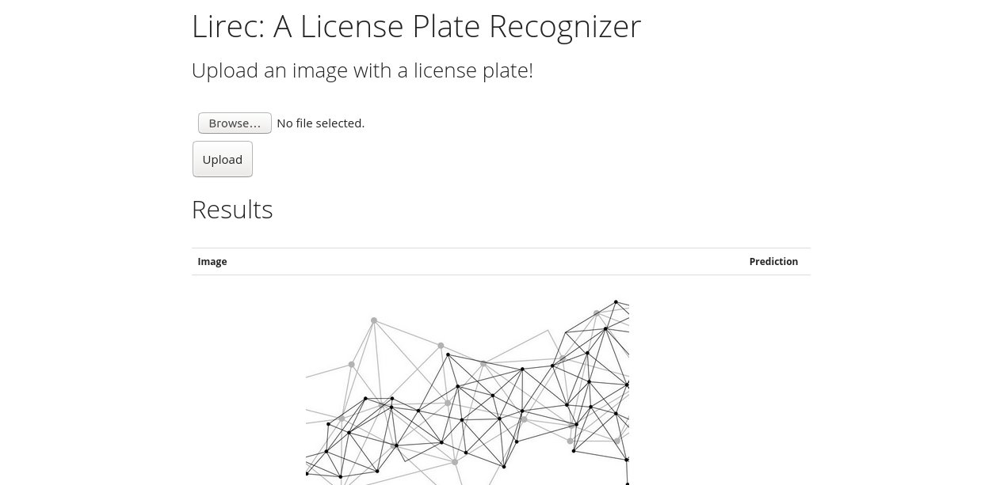

# LiRec-The-License-Plate-Recognition-App
A fully functional app deployed on Heroku that takes in an input image and detects and recognizes the license plate in it.
Link: https://lirec.herokuapp.com/

Additionally attached a deep learning model to improve accuracy.

